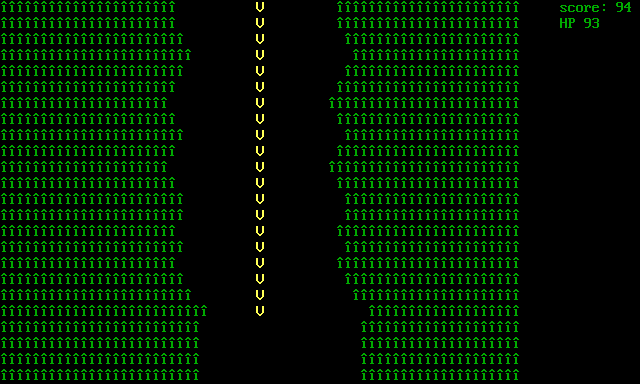
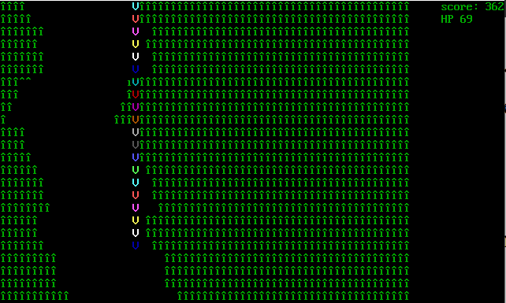
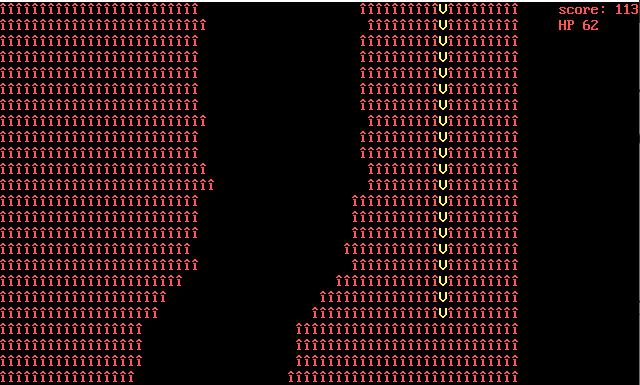

# 🛸 ASCII Valley Game (Assembly)

A classic-style ASCII game written entirely in **x86 Assembly** using **DOS interrupts**, where you control a spaceship navigating through a narrowing valley. Collect points, avoid collisions, survive longer — and unleash the **Power-Up** to become temporarily invincible!

---

## 🎮 Gameplay

- Control a spaceship (`V`) flying through a shifting valley.
- The valley narrows as difficulty increases over time.
- Survive and score as much as possible without hitting the valley walls.

---

## 🕹️ Controls

| Key       | Action                  |
|-----------|--------------------------|
| `A` / `←` | Move Left                |
| `D` / `→` | Move Right               |
| `Space`   | Activate Power-Up (if available) |

---

## 🔋 Power-Up Mechanic

- **Earn**: As your score increases, a Power-Up becomes available.
- **Notification**: When ready, "POWERUP" appears in the top-right corner.
- **Activation**: Press `Spacebar` to activate invincibility.
- **Duration**: Lasts for 100 frames (~a few seconds).
- **Effect**: Spaceship changes color (chromatic cycling), and becomes immune to damage.

---

## 💥 Damage & Game Over

- Colliding with tunnel walls reduces **HP** by 1.
- If **HP reaches 0**, the game ends.
- The final score is shown after the game over.

---

## 📈 Scaling Difficulty

- Every 100 lines:
  - Valley **narrows** (up to a minimum width).
  - Terrain variation **increases**, making the tunnel less predictable.
- Power-Up availability increases every 500 lines.

---

## 🖼️ Screenshots

1. **Normal Gameplay**  
   

2. **Power-Up Activated**  
   _Color-cycling spaceship during invincibility_
  
3. **Collision/Damage**  
   

---

## 🔧 Requirements

- **DOSBox** or other x86 real-mode emulator.
- Compatible with:
  - **MASM** or **TASM** for assembly
  - **LINK** for generating the `.EXE` file
